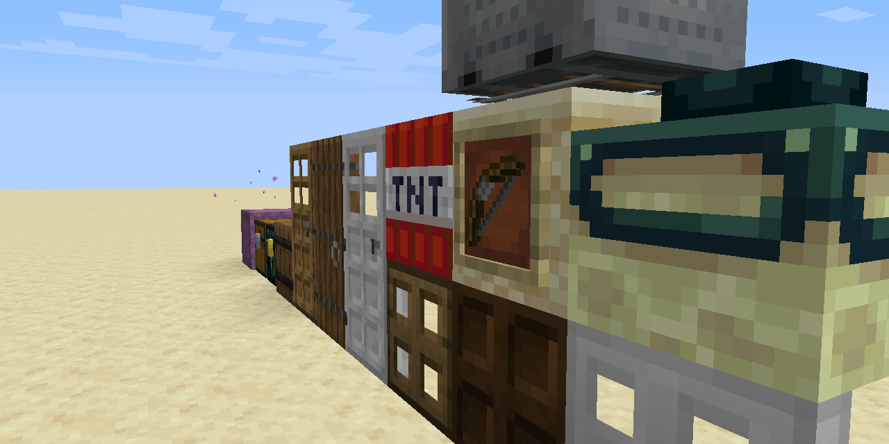

# Old Minecraft Sounds

A Minecraft resource pack that attempts to bring old sounds back into modern versions.
Please contribute with any old assets you may have lying around.

View the [offical webpage!](https://TheThunderGuyS.github.io/OldMinecraftSounds/)

View the [Downloads.](https://github.com/TheThunderGuyS/OldMinecraftSounds/releases)

Take your time to view my [non-existing "license".](LICENSE.md)

See my [Code of Conduct.](CODE_OF_CONDUCT.md)

Changes from the default sounds:
- Chests, barrels, Shulker boxes, doors both iron and wood as well as trapdoors and fence gates use the exact same sound.
- End portals no longer make sounds when placing Eyes of Ender or being activated.
- Old sounds for falls and damage!
- Eyes of Ender don't make a pop when dropping from the sky.
- Igniting fire with flint and steel makes a block place sound
- Bows, crossbows and snowballs/eggs/Ender pearls make the same sound. Drawing a crossbow is silent.
- Gaining experience and leveling up is silent.
- The Ender dragon uses the same hurt sound as the player and killing it is silent.
- Old water splash sounds are used.
- Old sounds for lava bubbling are used.
- Minecarts are silent.
- Shearing a sheep is silent.
- Old low quality explosions!
- Breaking a tool is silent.
- Zombies, husks, zombie villagers and drowned all have the same sounds.
- Rain has the old annoying noises.
- Underwater ambiance and entering/exiting water is silent.
- Squid squirting ink is silent.
- Old cow sounds! Milking is silent.
- Old Slime sounds.
- Old Creeper sounds.
- Old skeleton sounds.

Installation instructions:
 1. Download the pack.
 2. Place it in your `resourcepacks` folder.
 3. Enable it and enjoy!

The latest release is `Progress Update 4`.

************************************************************************
# Changelog

Progress Update 4 - September 11th, 2019
- I found a pile of [new sources!](https://archive.org/details/MinecraftAlphaResources) (Archived by me)
- Old cow sounds! (Milking is now silent)
- Strange old Slime sounds.
- Old metallic Creeper sounds.
- Old "bone-ey" skeleton sounds.
- The changes to cave sounds have been reverted. I'll fix them with sounds.json in the next update and remove subtitles for silent things.
- My pile of sounds has step sounds too! Coming next update.

Progress Update 3 - September 9th, 2019
- Rain now has the old annoying noises.
- All new cave sounds are now silent. Only 1-13 play.
- Underwater ambiance and entering/exiting water is now silent.
- Squid squirting ink is now silent.

Progress Update 2 - September 7th, 2019
- Zombies, husks, drowned and zombie villagers now all use the exact same sounds.

Progress Update 1(.1) - September 7th, 2019
- Since the previous version, the pack logo got a white circle around it rather than transparency so you can actually see it.

Progress Update 1 - September 7th, 2019

- Very first initial release. Highly unfinished.
- The following was changed from the default sounds (copied from above)
  - Chests, barrels, Shulker boxes, doors both iron and wood as well as trapdoors and fence gates use the exact same sound.
  - End portals no longer make sounds when placing Eyes of Ender or being activated.
  - Old sounds for falls and damage!
  - Eyes of Ender don't make a pop when dropping from the sky.
  - Igniting fire with flint and steel makes a block place sound
  - Bows, crossbows and snowballs/eggs/Ender pearls make the same sound. Drawing a crossbow is silent.
  - Gaining experience and leveling up is silent.
  - The Ender dragon uses the same hurt sound as the player and killing it is silent.
  - Old water splash sounds are used.
  - Old sounds for lava bubbling are used.
  - Minecarts are silent.
  - Shearing a sheep is silent.
  - Old low quality explosions!
  - Breaking a tool is silent.

*End of Changelog*
